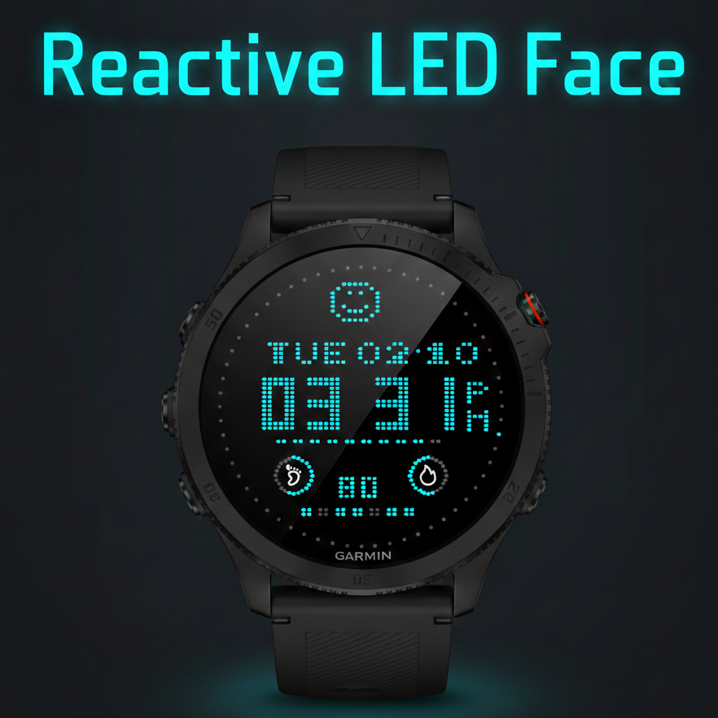
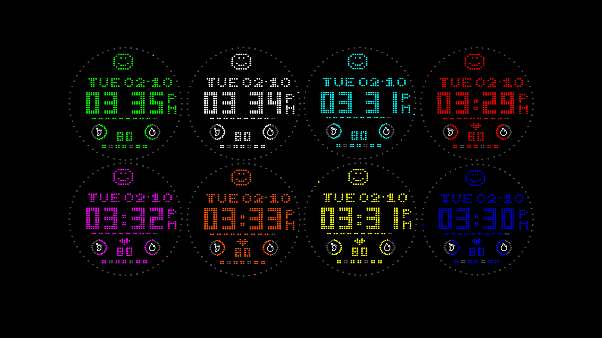
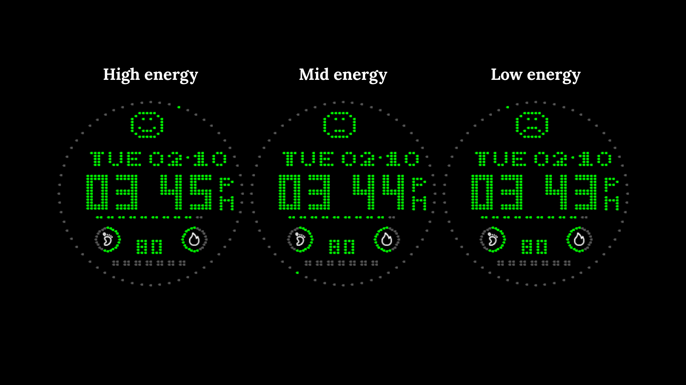
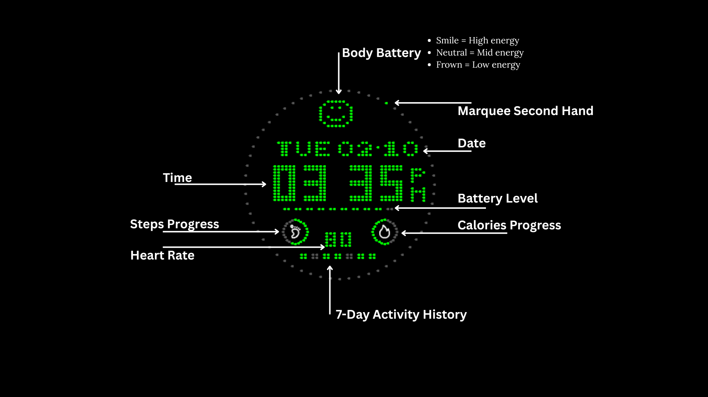

# LEDWF - LED点阵表盘 / LED Dot Matrix Watch Face

**LEDWF - LED点阵表盘**

复古 LED 点阵风格表盘，用像素点阵重新诠释时间与健康数据。

**功能一览**
- 大字体点阵时间显示，秒针外圈跑马灯
- 冒号与心形图标每秒闪烁，动感十足
- 身体电量表情：😊 充沛 / 😐 一般 / 😢 偏低
- 心率实时显示
- 步数与卡路里饼状图，进度一目了然
- 电池电量进度条
- 一周运动记录格子（日步数 > 5000 点亮）
- 星期 + 日期显示
- 支持 12/24 小时制，12 小时制显示 AM/PM
- 8 种 LED 颜色可选（白/红/绿/蓝/青/黄/橙/紫）
- 自动适配不同屏幕尺寸

纯点阵绘制，无图片依赖，低功耗运行。

---

## English Version

**LEDWF - LED Dot Matrix Watch Face**

A retro LED dot matrix style watch face that displays time and health data through pixel-perfect dot patterns.

**Features**
- Large dot matrix time display with a second hand marquee around the screen edge
- Blinking colon and heart icon for a lively LED feel
- Body Battery emoji: 😊 charged / 😐 moderate / 😢 low
- Real-time heart rate
- Step and calorie pie charts for quick progress tracking
- Battery level progress bar
- Weekly activity tracker (lights up when daily steps > 5,000)
- Day of week + date display
- 12/24 hour format support with AM/PM indicator
- 8 LED color options (White, Red, Green, Blue, Cyan, Yellow, Orange, Purple)
- Auto-adapts to different screen sizes

Fully rendered with dot patterns — no image assets, lightweight and power-efficient.
